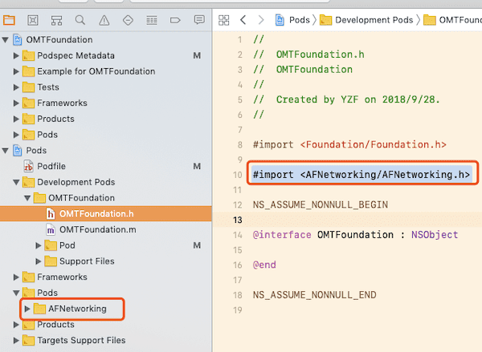
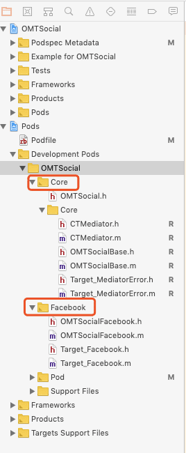
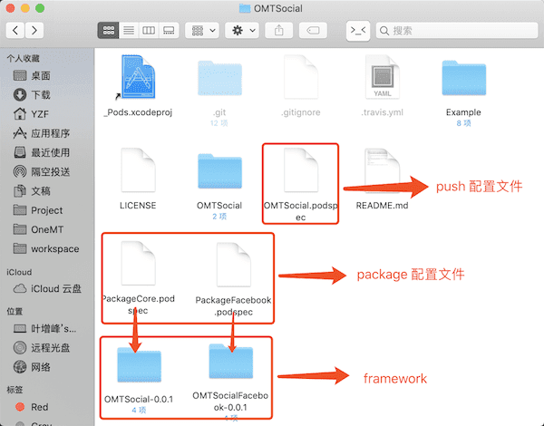

介绍了通过 `pod package` 命令打包 framework，以及对具有依赖关系的多个 subspecs 分别打包成独立的 framework。

<!--more-->

**环境：**
* Xcode 10
* CocoaPods 1.6.0
* iOS 12

#### (1) [Demo](https://github.com/Xiaoye220/Demos/tree/master/PodPackageDemo) 
因为内部使用的都是我自己的私有 Spec 地址，因此会造成 pod package 执行可能会出错

#### (2) 主要命令

```bash
pod package podName.podspec --force --embedded --no-mangle --exclude-deps --spec-sources=https://github.com/CocoaPods/Specs.git
```

```
//强制覆盖之前已经生成过的二进制库 
--force

//生成静态.framework 
--embedded

//生成静态.a 
--library

//生成动态.framework 
--dynamic

//动态.framework是需要签名的，所以只有生成动态库的时候需要这个BundleId 
--bundle-identifier

//不包含依赖的符号表，生成动态库的时候不能包含这个命令，动态库一定需要包含依赖的符号表。 
--exclude-deps

//表示生成的库是debug还是release，默认是release。--configuration=Debug 
--configuration
```

### 一、单个库打包

#### 1.创建项目

```bash
pod lib create OMTFoundation
```

#### 2.添加文件、pod依赖

项目目录结构如下：




#### 3.根目录下创建打包用 .podspec 文件 (package.podspec)

##### 注意：
* 使用 `pod package` 打包需要一个 `.podspec` 文件指定需要打包的的文件，这里用 `package.podspec` 作为配置文件，代码如下
* `s.name` 表示要打包的 framework 的名字
* `s.source` 使用本地路径会 git 的commit的代码进行打包，因此代码更新后一定要 commit，否则会一直打包旧的。使用 git 路径会从 git 上 clone 代码再打包
* `s.source_files` 指定需要打包的文件
* `s.dependency` 指定打包文件的依赖

```ruby
# package.podspec
Pod::Spec.new do |s|
  s.name             = 'OMTFoundation'
  s.version          = '0.0.1'
  s.summary          = 'A short description of OMTFoundation.'

  s.description      = <<-DESC
TODO: Add long description of the pod here.
                       DESC

  s.homepage         = 'https://github.com/Xiaoye220/OMTFoundation'
  s.license          = { :type => 'MIT', :file => 'LICENSE' }
  s.author           = { 'Xiaoye220' => '576934532@qq.com' }
  s.source           = { :git => '/Users/YZF/Desktop/CocoaPodsTest/OMTFoundation' }

  s.ios.deployment_target = '7.0'

  s.source_files = 'OMTFoundation/Classes/**/*'
  
  s.dependency 'AFNetworking'

end
```

#### 4.执行打包命令

```bash
pod package package.podspec --no-mangle --exclude-deps --spec-sources=https://github.com/CocoaPods/Specs.git --force
```

成功后会在当前目录下生成一个 `OMTFoundation-0.0.1` 文件夹

#### 5.执行 pod push 发布 framework

##### 注意：

- 下面的 `.podspec` 文件可以通过 `ENV['lib']` 控制上传 framework 还是上传源码
- `pod repo push Specs` 会上传源码
- `lib=1 pod repo push Specs` 会上传 framework

```ruby
# OMTFoundation.podspec
Pod::Spec.new do |s|
  s.name             = 'OMTFoundation'
  s.version          = '0.0.1'
  
  # .... 省略

  if ENV['lib']
    s.ios.vendored_frameworks = 'OMTFoundation-' + s.version + '/ios/OMTFoundation.framework' 
  else
    s.source_files = 'OMTFoundation/Classes/**/*'
  end

  s.dependency 'AFNetworking'

end
```

### 二、有依赖关系的 subspecs 分别打包成 framework

这里模拟一个社会化组件，该组件有多个 `subspec`，其中 `OMTSocial/Core` 为基础 `subspec`，其余的如 `OMTSocial/Facebook` 等都要依赖  `OMTSocial/Core` ，分别模拟 `Facebook` 等平台的登录分享模块，做到这个组件可以按照自己想要的平台添加依赖。

#### 1.创建项目

```bash
pod lib create OMTSocial
```

#### 2.添加文件、pod依赖

subspec 的依赖关系：`Core` 为基础 subspec，`Facebook` 依赖 `Core`

项目目录结构如下：




#### 3.打包 subspec - Core

**由于一个 .podspec 只能生成一个 framework，因此每个 subspec 都要一个 .podspec 文件作为配置文件打包**

##### 注意：
* 创建 `PackageCore.podspec` 文件为打包 `Core` 提供支持，内容如下。

* `s.name` 应该为 OMTSocial，这样其他模块才可以通过 `#import <OMTSocial/OMTSocial.h>` 引入头文件，这样子可以使开发过程中和打包过程的引入头文件的方式统一，避免其中会有一个失败，并且 `Core` 编译成功后生成的为 `OMTSocial.framework`

```ruby

# PackageCore.podspec
Pod::Spec.new do |s|
  s.name             = 'OMTSocial'
  s.version          = '0.0.1'
  s.summary          = 'A short description of OMTSocial.'

  s.description      = <<-DESC
TODO: Add long description of the pod here.
                       DESC

  s.homepage         = 'https://github.com/Xiaoye220/OMTSocial'
  s.license          = { :type => 'MIT', :file => 'LICENSE' }
  s.author           = { 'Xiaoye220' => '576934532@qq.com' }
  s.source           = { :git => '/Users/YZF/Desktop/CocoaPodsTest/OMTSocial'}

  s.ios.deployment_target = '7.0'

  s.subspec 'Core' do |sp|
     sp.source_files = 'OMTSocial/Classes/*', 'OMTSocial/Classes/Core/*'
  end
end
```

##### 执行打包命令

`--subspecs` 为把指定 subspecs的文件进行打包，可以添加多个

```bash
pod package PackageCore.podspec --no-mangle --exclude-deps --spec-sources=https://github.com/CocoaPods/Specs.git,https://github.com/Xiaoye220/Specs.git --force --subspecs=Core
```

#### 4.打包 subspec - Facebook

##### 注意：
* 创建 `PackageFacebook.podspec` 文件为打包 `Facebook` 提供支持，内容如下。

* ` s.subspec 'Facebook'` 中要使用上面完成的 `OMTSocial.framework` ，需要通过 `sp.ios.vendored_frameworks = 'OMTSocial-0.0.1/ios/OMTSocial.framework'` 这种方式依赖。

* 除了上面那种方式使用 `OMTSocial.framework`，还可以用 `sp.dependency 'OMTSocial/Core'`，但是这个方法必须先发布 `OMTSocial/Core` 才能正确依赖

* `Facebook` 中要导入 `Core` 中头文件，要使用 `#import <OMTSocial/OMTSocialBase.h>`，表示是从 `OMTSocial.framework` 中导入。若是用 `#import "OMTSocialBase.h"` 会找不到头文件。

```ruby
# PackageFacebook.podspec

Pod::Spec.new do |s|
  s.name             = 'OMTSocialFacebook'
  s.version          = '0.0.1'
  s.summary          = 'A short description of OMTSocial.'

  s.description      = <<-DESC
TODO: Add long description of the pod here.
                       DESC

  s.homepage         = 'https://github.com/Xiaoye220/OMTSocial'
  s.license          = { :type => 'MIT', :file => 'LICENSE' }
  s.author           = { 'Xiaoye220' => '576934532@qq.com' }
  s.source           = { :git => '/Users/YZF/Desktop/CocoaPodsTest/OMTSocial'}

  s.ios.deployment_target = '7.0'

  s.subspec 'Facebook' do |sp|
     sp.source_files = 'OMTSocial/Classes/Facebook/*'
     sp.ios.vendored_frameworks = 'OMTSocial-0.0.1/ios/OMTSocial.framework'
     # sp.dependency 'OMTSocial/Core'
  end

end
```

##### 执行打包命令

##### 注意：
* 打包后的 `OMTSocialFacebook.framework` 会把 `OMTSocial.framework` 中的头文件也添加进来，但是这些头文件仅仅做 `import` 时查找用，不影响其他。

```bash
pod package PackageFacebook.podspec --no-mangle --exclude-deps --spec-sources=https://github.com/CocoaPods/Specs.git,https://github.com/Xiaoye220/Specs.git --force --subspecs=Facebook
```

#### 5.发布

打包完成后的目录




执行 Push 命令

```bash
pod repo push Specs OMTSocial.podspec --sources=https://github.com/CocoaPods/Specs.git,https://github.com/Xiaoye220/Specs.git --verbose --use-libraries --allow-warnings
```

### 三、自动打包脚本

#### 1. package.podspec

为了避免每一个 subspec 都要一个 .podspec 文件才能打出指定名字的包，可以统一为一个 `package.podspec` 文件，根据传入的参数自动打出指定名称的包

##### 注意：
* `ENV['subspec']` 是传递参数用的，如指令 `subspec=Core pod package package.podspec .....`，那么 `ENV['subspec']` 的值为 "Core"
* `sp.dependency "#{s.name}/Core"`，倒数第三行这个表示依赖当前文件的 `Core` 这个 subspec。

```ruby
Pod::Spec.new do |s|

  # 从 ENV['subspec'] 获取当前要打包的 subspec 的 name
  subspec_name = ENV['subspec'].to_s
  # 根据 subspec_name 的不同生成不同的 s.name
  s_name = subspec_name == 'Core' ? 'OMTSocial' : 'OMTSocial' + subspec_name

  s.name             = s_name
  s.version          = '0.0.1'
 
  # ...... 其余不重要信息省略

  s.subspec 'Core' do |sp|
    # 打包 Core 使用源码，打包其他 subspec 使用 framework
    if subspec_name == 'Core'
      sp.source_files = 'OMTSocial/Classes/*', 'OMTSocial/Classes/Core/*'
    else
      sp.ios.vendored_frameworks = 'OMTSocial-' + s.version.to_s + '/ios/OMTSocial.framework'
    end
  end

  s.subspec 'Facebook' do |sp|
    sp.source_files = 'OMTSocial/Classes/Facebook/*'
    sp.dependency "#{s.name}/Core"
  end
end
```

#### 2. package.sh

这是一个 `shell` 脚本，指定所有 subspec 的 name，可以自动化打包所有 subspec 并发布

##### 注意
* 第一行声明用于 `pod repo push` 用的 .podspec 文件名
* 第二行用一个数组声明所有的 subspec
* 熟悉 shell 脚本的，上面的数据也可以通过指令从实际 `OMTSocial.podspec` 中获取，实现完全自动化。我这里只是简单手写赋值。

```bash
push_podspec_name=OMTSocial.podspec

subspecs=(Core Facebook)

podspec_path=$PWD/$push_podspec_name

# 获取版本号
version=`grep -E "s.version |s.version=" $podspec_path | head -1 | sed 's/'s.version'//g' | sed 's/'='//g'| sed 's/'\"'//g'| sed 's/'\''//g' | sed 's/'[[:space:]]'//g'`


for subspec in ${subspecs[@]}
do
  # 打包指令
  subspec="${subspec}" pod package package.podspec --subspecs="${subspec}" --no-mangle --exclude-deps --force  --spec-sources=https://github.com/CocoaPods/Specs.git,https://github.com/Xiaoye220/Specs.git

  # 打包完 commit，避免 package 时还是使用旧的代码
  git add .
  git commit -m "package ${subspec}"
done


git push origin master

git tag -d $version
git push origin :refs/tags/$version

git tag -a $version -m $version
git push origin --tags
pod cache clean --all

pod repo push Specs "${push_podspec_name}" --use-libraries --allow-warnings --verbose --sources=https://github.com/CocoaPods/Specs.git,https://github.com/Xiaoye220/Specs.git 
```