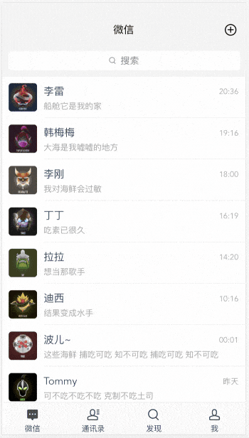

业余 Vue.js 选手对于 CSS 布局真的很头疼，因此通过这个 **`低仿`** 微信 的练习稍微熟悉一下基本开发，同时开发中涉及到的一点知识做了简单整理。
很多 icon 都是临时找差不多的替代的，真的很低仿 

环境
`@vue/cli` : 3.0

### [Demo](https://github.com/Xiaoye220/Vue.js/tree/master/wechat)

### 1. 效果图



### 2. iconfont

#### 2.1 使用 iconfont

通过 [iconfont](https://www.iconfont.cn/) 选择想要的图标，下载 iconfont 文件，将下载的文件添加至 `assets` 目录下，通过以下方式使用

```js
import '@/assets/style/iconfont/iconfont.css'
```

```html
<div class="iconfont size">&#xe697;</div>
```

#### 2.2 读取 data 中的 iconfont unicode 编码

```js
// 定义数据
export default {
    name: "Search",
    data() {
        return {
			icon: "\ue632"
        }
    }
}
```

```html
// 使用
<span class="iconfont">{{icon}}</span>
```

#### 2.3 placehold 中使用 iconfont

和 `2.2` 中实现类似

```js
// 定义数据
export default {
    name: "Search",
    data() {
        return {
            placeholder: "\ue741 搜索"
        }
    }
}
```

```html
<input type="text" class="search-input iconfont" :placeholder="placeholder"/>
```


### 3.SCSS

Sass 是世界上最成熟、最稳定、最强大的专业级CSS扩展语言

`SCSS` 是 Sass 3 引入新的语法，其语法完全兼容 CSS3，并且继承了 Sass 的强大功能。也就是说，任何标准的 CSS3 样式表都是具有相同语义的有效的 SCSS 文件。

由于 SCSS 是 CSS 的扩展，因此，所有在 CSS 中正常工作的代码也能在 SCSS 中正常工作。也就是说，对于一个 Sass 用户，只需要理解 Sass 扩展部分如何工作的，就能完全理解 SCSS。大部分扩展，例如变量、parent references 和 指令都是一致的；唯一不同的是，SCSS 需要使用分号和花括号而不是换行和缩进。

#### 3.1 声明变量

声明

```css
$status-height: 20px;
$header-height: 44px;
```

使用

```css
.statusBar-wrapper {
    // ......
    height: $status-height;
}
```

#### 3.2 @mixin

使用 `@mixin` 定义的样式可以通过 `@include` 在任何地方使用

##### 3.2.1 基本使用

声明

```css
@mixin scroll-style {
  -webkit-overflow-scrolling: touch; // iOS 滚动回弹
  will-change: scroll-position; // 提高性能，提前通知浏览器即将进行的改动
  contain: size style layout;   // 允许开发者声明当前元素和它的内容尽可能的独立于 DOM 树的其他部分
  overflow-x:hidden;
  overflow-y: scroll;
}
```

使用

```css
.scroller-wrapper { 
    // ......
    @include scroll-style;
}
```

##### 3.2.2 带参数的 `@mixin`

声明，`#000` 为默认值，可以不写

```css
@mixin statusBar-style($bgColor: #000) { 
  width: 100%;
  height: $statusBar-height;
  background: $bgColor;
}
```

使用

```css
.statusBar-wrapper {
    position: relative;
    @include statusBar-style(#eee)
}
```

### 4. Vue

#### 4.1路由 Router 

##### 4.1.1 嵌套路由

一个 `<router-view>` 中包含另一个 `<router-view>` 时，此时要使用嵌套路由

以下路由表示在 `app.vue` 中通过 `<router-view>` 打开路径 `/wechat` 的一个 微信视图，在微信视图中又包含另一个 `<router-view>`，可以展示路径分别为 `wechat/home`、`wechat/addressBook`、`wechat/discover`、`wechat/me` 的四个页面

```js
export default new Router({
    mode: 'history',
    base: process.env.BASE_URL,
    routes: [
        {
            path: '/',
            name: 'home',
            component: Home
        }, {
            path: '/wechat',
            name: 'wechat',
            component: WeChat,
            children: [{
                path: 'home',
                component: WeChatHome
            },{
                path: 'addressBook',
                component: WeChatAddressBook
            },{
                path: 'discover',
                component: WeChatDiscover
            },{
                path: 'me',
                component: WeChatMe
            }]
        }
    ]
})
```

##### 4.1.2 router-link 点击事件 @click

`router-link` 的 Dom 原生点击事件会被本身的跳转点击覆盖，可以通过 `@click.native` 只能监听Dom 原生点击事件

```html
<router-link @click.native="selectedIndex = index"></router-link>
```

##### 4.1.3 重定向

要想访问 `localhost:8080` 实际访问 `localhost:8080/home` 可以设置重定向，如下

```js
export default new Router({
    mode: 'history',
    base: process.env.BASE_URL,
    routes: [{
        path: '/',
        component: WeChat,
        redirect: '/home',
    }]
})
```

##### 4.1.4 [动态路由匹配](https://router.vuejs.org/zh/guide/essentials/dynamic-matching.html#%E5%93%8D%E5%BA%94%E8%B7%AF%E7%94%B1%E5%8F%82%E6%95%B0%E7%9A%84%E5%8F%98%E5%8C%96)

##### 4.1.5 路由的动态过渡，类似 iOS push 时动画效果

```vue
<template>
    <div id="app">
        <transition :name="transitionName">
            <router-view class="router-view"></router-view>
        </transition>
    </div>
</template>

<style>
    .router-view {
        width: 100%;
        height: 100%;
        position: absolute;
        transition: all 0.3s;
    }
    .slide-left-enter {
        opacity: 0;
        transform: translate(100%, 0);
    }

    .slide-left-leave-to {
        opacity: 0.8;
        /*transform: translate(-100%, 0);*/
    }
    .slide-right-enter {
        opacity: 0;
        transform: translate(-100%, 0);
    }
    .slide-right-leave-to {
        opacity: 0.8;
    }
</style>

<script>
    import WeChat from "@/views/WeChat";
    export default {
        components: {WeChat},
        data() {
            return {
                transitionName: 'slide-left'
            }
        },
        watch: {
            '$route' (to, from) {
                const toDepth = to.path.split('/').length;
                const fromDepth = from.path.split('/').length;
                this.transitionName = toDepth < fromDepth ? 'slide-right' : 'slide-left';
            }
        }
    }
</script>
```


#### 4.2 Style 绑定

可以通过 style 绑定的方式，设置组件样式

```vue
<template>
    <div>
        <div class="header-wrapper" :style="{ background: bgColor, color: color }"></div>
    </div>
</template>

export default {
    name: "Header",
    props: {
        bgColor: String,
        color: String,
    }
}
```

#### 4.3 获取 Public 静态资源

这里的静态资源指 `@vue/cli 3.0` 中 `public` 文件夹的文件

##### 4.3.1 本地 mock

要访问 public 目录下的文件 index.json

可以直接访问  `localhost:8080/index.json`

```js
// 请求 public 目录下的 mock/index.json 文件
// axios 为请求库
axios.get('/mock/index.json')
```

##### 4.3.2 本地 image

要访问 public 目录下的文件1.jpg

- 在 `public/index.html` 或其它通过 `html-webpack-plugin` 用作模板的 HTML 文件中，需要通过 `<%= BASE_URL %>` 设置链接前缀：

  ```html
  <link rel="icon" href="<%= BASE_URL %>1.jpg">
  ```

- 在模板中，首先需要向组件传入基础 URL

  ```js
  data () {
    return {
      publicPath: process.env.BASE_URL
    }
  }
  ```

  然后

  ```html
  
  ```

#### 4.4 路径

##### 4.4.1 src 与 @ 

@vue/cli 3 中 `@` 符号表示` src` 目录，因此可以使用以下方式表示路径

```js
import HomeHeader from '@/components/home/Header'
```

但是，虽然  `@` 符号表示` src` 目录，以下写法却是有问题的。因为写成 `@` 在打包时可以通过该符号确认是 `src `路径从而找到路径下的东西，但是使用以下这种相对路径的写法却会在打包时解析不出路径。

```js
// 错误
import HomeHeader from 'src/components/home/Header'
```

##### 4.4.2 自定义别名

在 `vue.config.js` 文件修改配置，修改配置后需要**重启服务器**

```js
module.exports = {
    // 设置 webpack
    chainWebpack: config => {
        // 设置别名
        config.resolve.alias
            .set('@styles', '@/assets/styles')
    }
};
```

或者这个方式

```js
let path = require('path');
function resolve (dir) {
    return path.join(__dirname, dir)
}
module.exports = {
    // 设置 webpack
    chainWebpack: config => {
        // 设置别名
        config.resolve.alias
            .set('@styles', resolve('src/assets/styles'))
    }
};
```

使用

```js
// 表示的实际路径为 src/assets/styles/reset.css
import '@styles/reset.css'
```

##### 4.4.3 data 中使用本地 image 的相对路径

以下代码上面注释的那种写法会有问题，因为放在模版里是会被 `webpack` 打包出来。而在 `js` 里写图片路径其实只是字符串， `webpack` 不会处理。需要使用 `import`、 `require` 引入

```js
data() {
    return {
        //url: "../../../assets/logo.png"     
        url: require("../../../assets/logo.png")
    }
}
```


#### 4.5 代理 proxy

在  `vue.config.js` 中添加如下代码，实现的功能就是

- 如一个接口请求 `axios.get('/api/index.json')`，那么通过重定向后实际请求的地址为 `axios.get('http://localhost:8080/mock/index.json')`
- `target` 表示代理的目标地址
- `changeOrigin` 表示是否支持重定向
- `pathRewrite` 重写路径

```js
module.exports = {
    // ........
    devServer: {
        proxy: {
            '/api': {
                target: 'http://localhost:8080',
                changeOrigin: true,
                pathRewrite: {
                    '^/api' : '/mock'
                }
            }
        }
    }
};
```

#### 4.6 禁止点击事件向上冒泡

如下，点击 cell 时为了不触发 mask 的点击，可以在 cell 的使用 `@click.stop` 禁止点击事件向上冒泡

```html
<template>
    <div class="mask" @click="$emit('clickMask')">
        <ul>
            <li class="cell" @click.stop="$emit('clickCell', index)"></li>
            <!-- ...... -->
        </ul>
    </div>
</template>
```


