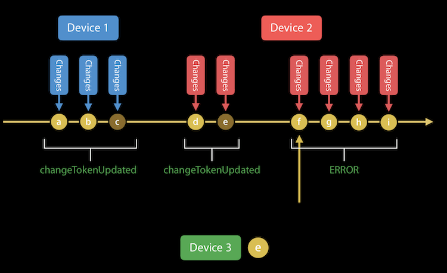

使用 CloudKit 的一大好处就是可以在不同设备间同步数据，比如我的 iPhone 、 iPad 和 Mac 都可以使用同一份数据，我们看看如何实现

<!--more-->

### 1.订阅数据修改的通知

订阅通知，当其他设备修改了 iCloud 会受到推送通知

iCloud 总共有 3 个类型的订阅

| 类型                     | 备注                                                         | 支持的Database  |
| ------------------------ | ------------------------------------------------------------ | --------------- |
| CKDatabaseSubscription   | A subscription for database changes                          | private、shared |
| CKRecordZoneSubscription | A subscription that causes a push notification to fire whenever any change happens in the specified record zone. | public、private |
| CKQuerySubscription      | 订阅具体的 CKRecord 的改变                                   | public、private |

推送在模拟器上是无法使用的，可以在真机上订阅后，在后台直接修改数据或者通过模拟器修改数据，在真机上观察是否有推送到达

#### 1.1 Save Subscriptions to the Database

以下会将一个订阅添加到 Database，每当 `name = "Tommy"` 的数据创建、删除、更新的时候，会接收到推送通知

```swift
let predicate = NSPredicate(format: "name == %@", "Tommy")
let options = [CKQuerySubscription.Options.firesOnRecordDeletion, 			  CKQuerySubscription.Options.firesOnRecordCreation, CKQuerySubscription.Options.firesOnRecordUpdate]
let subscription = CKQuerySubscription(recordType: recordType, predicate: predicate, subscriptionID: subscriptionID, options: options)

let notificationInfo = CKSubscription.NotificationInfo()
// 开启静默推送
notificationInfo.shouldSendContentAvailable = true
// 普通推送
notificationInfo.alertBody = "Tommy"
notificationInfo.shouldBadge = true

subscription.notificationInfo = notificationInfo

CKContainer.default().publicCloudDatabase.save(subscription) { (subscription, error) in
    // TODO:
}
```

> 注意：
>
> If you don’t set any of the [`alertBody`](apple-reference-documentation://hsfhkhaAPE), [`soundName`](apple-reference-documentation://hshfePtlZ7), or [`shouldBadge`](apple-reference-documentation://hsE3e74D9F) properties, the push notification is sent at a lower priority that doesn’t cause the system to alert the user.

#### 1.2 Register for Push Notifications

iOS 10 之后的普通推送权限获取

```swift
import UserNotifications

UNUserNotificationCenter.current().requestAuthorization(options: [.alert, .sound, .badge]) { (accepted, error) in
    // TODO:
}
```

iOS 10 之后的推送注册

```swift
func application(_ application: UIApplication, didFinishLaunchingWithOptions launchOptions: [UIApplication.LaunchOptionsKey: Any]?) -> Bool {
    application.registerForRemoteNotifications()
    return true
}
```

#### 1.3 Handle Push Notifications in Code

```swift
func application(_ application: UIApplication, didReceiveRemoteNotification userInfo: [AnyHashable : Any]) {
    let cloudKitNotification = CKNotification(fromRemoteNotificationDictionary: userInfo)
    
    if(cloudKitNotification?.subscriptionID == subscriptionID) {
    	if(cloudKitNotification?.notificationType == CKNotification.NotificationType.query) {
            let queryNotification = cloudKitNotification as! CKQueryNotification
            let recordID = queryNotification.recordID

            // TODO
        }
	}
}
```

但是这里有一点需要注意的，就是推送是可能会丢失的。推送可以根据设备条件进行合并，这个指的是如果一个订阅触发了并且一个推送发到你用户的设备上，但是某些情况下不一定收到推送，这个合并协定的目的就是要至少实现其中一个推送。因此我收到推送时不应该根据推送确定是什么数据改变了，而是应该根据推送确定有数据改变了，并去 iCloud 获取所有的改变。那么我们下面看看如何获取 iCloud 数据改变

### 2.获取 iCloud Changes

首先我们来看看 iCloud 是怎么确定 changes 



如上图，我们可以看到 iCloud 是通过一个 changeToken 来确定 changes 的。每台设备更新修改数据后，会更新 changeToken。我拿着我设备上的 changeToken 去 iCloud 服务器 fetch changes，就可以获取到该 token 之后的所有改变，当然可以通过一些 API 设置 resultLimit

#### 2.1 Fetch Database Changes

首先我们先获取整个 database 的改变，从中可以获取到改变的 zone

这里注意 publicDatabase 是不能 fetch changes 的，否则会报错 `can't retrieve zone changes in public DB`

```swift
// 这里注意，如果 previousServerChangeToken 为 nil，那么就是获取所有的 changes
let changesOperation = CKFetchDatabaseChangesOperation(previousServerChangeToken: nil) 

changesOperation.fetchAllChanges = true

// 保存所有有改变的 zoneID
changesOperation.recordZoneWithIDChangedBlock = { zoneID in
    self.changedZoneIDs.append(zoneID)
}
// 删除本地的数据
changesOperation.recordZoneWithIDWasDeletedBlock = { zoneID in
                                                    
}
// token 更新
changesOperation.changeTokenUpdatedBlock = { token in
     
}

changesOperation.fetchDatabaseChangesCompletionBlock = { (newToken: CKServerChangeToken?, more: Bool, error: Error?) in
    // 如果上面 changesOperation.fetchAllChanges = false， 那么 changes 有可能会分段返回
    // 这里的 more 就用来标识后面是否还有 changes
      
    // 在这个缓存 token 下次使用
    // 用官方的话说就是 saving the change token at the end of the operation 
                                                        
    // 根据 changedZoneIDs 获取 zone 中 record 的改变
	self.fetchZoneChanges(changedZoneIDs) 
}
self.privateDB.add(changesOperation)
```

#### 2.2 Fetch Zone Changes

在 `CKFetchRecordZoneChangesOperation` 的各种回调中处理数据，比如更新本地缓存 CKRecord，更新本地的 changeToken 等等。这样子就将当前设备的数据与 iCloud 上的同步完成了

这里注意，`recordZoneChangeTokensUpdatedBlock` 在我使用过程中没有回调，不知道原因。因此对于缓存 token 的操作最好放在 `recordZoneFetchCompletionBlock` 中，并且我们看它的 `Discussion` 可以看到 `saving the change token at the end of the operation and passing it into the next call` 的描述

```swift
func fetchZoneChanges(recordZoneIDs: [CKRecordZone.ID]) {
    // 可以通过 optionsByRecordZoneID 设置 token、resultLimit 等
    let changesOperation = CKFetchRecordZoneChangesOperation(recordZoneIDs: recordZoneIDs, optionsByRecordZoneID: nil)
    
    // record 改变
    changesOperation.recordChangedBlock = { record in
                                           
    }
    // record 删除
    changesOperation.recordWithIDWasDeletedBlock = { (recordID, recordType) in
                                                    
    }
    // 某个 zone 的 changToken 更新
    changesOperation.recordZoneChangeTokensUpdatedBlock = { (zoneID, token, tokenData) in
                                                           
    }
    // 某个 zone 的 fetchChanges 操作完成
    changesOperation.recordZoneFetchCompletionBlock = { (zoneID, token, tokenData, moreComing, error) in
    	// 在这个缓存 token 下次使用
        // 用官方的话说就是 saving the change token at the end of the operation                                              
    }
    // 所有 zone 的 fetchChanges 操作完成
    changesOperation.fetchRecordZoneChangesCompletionBlock = { error in
                                                              
    }
    
    self.privateDB.add(changesOperation)
}
```

### 3.数据持久化

我们要将 iCloud 上的数据（包括 CKServerChangeToken，CKRecord，CKRecordZone 等）缓存在本地，这里有一个很方便的方式，使用归档

#### 3.1 对象归档

因为这些对象都使用了 `NSSecureCoding` 协议，所以我们可以通过以下方法进行归档

```swift
public struct CloudArchiver {
    public static func archiver<T: NSSecureCoding>(_ obj: T) -> Data {
        // obtain the metadata from the CKRecord
        let data = NSMutableData()
        let coder = NSKeyedArchiver(forWritingWith: data)
        coder.requiresSecureCoding = true
        obj.encode(with: coder)
        coder.finishEncoding()
        
        return data as Data
    }
    
    public static func unarchiver<T: NSSecureCoding>(_ data: Data) -> T? {
        let coder = NSKeyedUnarchiver(forReadingWith: data)
        coder.requiresSecureCoding = true
        let obj = T(coder: coder)
        coder.finishDecoding()
        
        return obj
    }
}


// 使用
let data = CloudArchiver.archiver(token)
let token: CKServerChangeToken = CloudArchiver.unarchiver(data)
```

#### 3.2 CKRecord 元数据归档

对于一个 `CKRecord` 会有一些元数据，如 record name、zone ID、change tag、creation date 等。官方提供了API 对其进行缓存

```swift
// obtain the metadata from the CKRecord
let data = NSMutableData()
let coder = NSKeyedArchiver.init(forWritingWith: data)
coder.requiresSecureCoding = true
record.encodeSystemFields(with: coder)
coder.finishEncoding()
// 缓存 data


// set up the CKRecord with its metadata
let coder = NSKeyedUnarchiver(forReadingWith: yourLocalObject.encodedSystemFields!)
coder.requiresSecureCoding = true
let record = CKRecord(coder: coder)
coder.finishDecoding()
// write your custom fields...
```


> 参考资料
>
> [WWDC 2016 - CloudKit Best Practices](https://developer.apple.com/videos/play/wwdc2016/231/?time=31)
>
> [WWDC 2016 - What's New with CloudKit](<https://developer.apple.com/videos/play/wwdc2016/226>)
>
> [WWDC 2017 - Build Better Apps with CloudKit Dashboard](<https://developer.apple.com/videos/play/wwdc2017/226>)
>
> [CloudKit Quick Start](<https://developer.apple.com/library/archive/documentation/DataManagement/Conceptual/CloudKitQuickStart/Introduction/Introduction.html#//apple_ref/doc/uid/TP40014987-CH1-SW1>)
​~~~

~~~~~

~~~~~