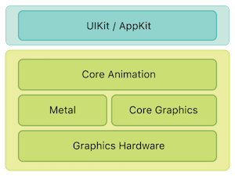

最近想了解了解图像处理的一些知识，就挑了 Metal 下手。实话实说，看得挺吃力的，慢慢来吧，希望通过一段时间学习后能有所收获。

<!--more-->

这里推荐一下小专栏里的 [iOS 图像处理](<https://xiaozhuanlan.com/colin>)，写的很棒，帮了不少忙。

本文就是记录一下看完前两章总结、**摘抄**的一些收获

### 1.Metal 是什么

从 [Apple Developer](<https://developer.apple.com/metal/>) 上摘抄的就是以下说明

> Metal provides near-direct access to the graphics processing unit (GPU), enabling you to maximize the graphics and compute potential of your apps on iOS, macOS, and tvOS. Building on an approachable, low-overhead architecture with precompiled GPU shaders, fine-grained resource control, and multithreading support, Metal further evolves support for GPU-driven command creation, simplifies working with the array of Metal-capable GPUs, and lets you tap into Pro power of Mac Pro and Pro Display XDR.

>Metal 提供接近直接使用 GPU 的能力，使你的应用能最大化图形和计算的能力。通过预编译 GPU着色器、细粒度资源控制和多线程支持，构建一个易使用的、低开销的结构。Metal 支持创建驱动 GPU 的命令，简化了 GPU 的使用。

 简言之就是 Metal 提供了一组简明的 API，使得我们开发者拥有了直接和 GPU 对话的能力

### 2.Metal 的优点

* 更低的 CPU 开销，这个其实我理解了很久，为啥是提升 CPU 的而不是 GPU。最后琢磨明白了就是因为 Metal 是通过 CPU 生成 GPU Commands 再交给 GPU 执行，Metal 相比 OpenGL 大大提升了 GPU Commands 转换的速度。
* 最佳的 GPU 性能
* 最大程度的保证 CPU、GPU 的协作能力，使它们两人能同时处于忙碌状态，而不是会有一个是闲置的
* 简单易上手的 API
* Metal 在构建时完成源码编译，在运行时作为一个 library 加载，减少编译 Metal 造成的一大笔开销

### 3.CPU 和 GPU

CPU 和 GPU 的结构如下图，我们可以很直观看到，GPU 有很多的 ALU，GPU 可以通过在各个计算单元之间分配工作负载，共同处理大量数据，**GPU是专为执行复杂的数学和几何计算而设计的**

- **ALU**（Arithmetic and Logic Unit），即计算单元
- **Cache**，进行高速数据交换的存储器
- **DRAM**（Dynamic Random Access Memory），即动态随机存取存储器，最为常见的系统内存

### 4.渲染管线（Render Pipeline）是什么

渲染管线，实际上指的是一堆原始图形数据途经一个输送管道，期间经过各种变化处理最终出现在屏幕的过程。通常情况下，渲染管线有三个阶段，其中光栅化阶段不可编程，其他两个可以

1. 顶点着色器（vertex stage），接收一组顶点数据数组，来限定显示／处理区域
2. 光栅化阶段（rasterization stage），在光栅化阶段，确定哪些像素位于边界，裁剪超出边界的像素
3. 片段着色器（fragment stage），计算每一个像素最终的颜色值

整个过程按照我的理解一个三角形渲染管线应该是这样的，不知道有没有问题

1. 在屏幕中确认三个顶点
2. 三个顶点确认一个图元，图元中的像素不包含颜色等信息
3. 经过光栅化，裁剪点图元中超出边界的像素，确认每个像素中的颜色、深度、纹理等信息，生成片段。片段应该是包含一组像素以及其对应的信息
4. 片段根据那组像素的信息计算出每个像素最终的颜色值

### 5.Core Animation、Core Graphic、Metal 的区别

首先我们看一下以下这个经典的图

在架构设计上，Metal 和 Core Graphics 属于同一级，最接近 Graphics Hardware，不同的是 Metal 使用的是GPU 的渲染能力，Core Graphics 使用的是 CPU 的渲染能力

而 Core Animation 处于更高的一级，Core Animation 通过使用 Metal 和 Core Graphics 去完成绘制。

但是封装层级越高，往往意味着性能越差，功能越少。因此，为了追求更好的性能和实现更强大的功能，我们可以绕过 Core Animation，直接调用 Metal 和 Core Graphics 渲染、绘制图像。但是也说了，GPU 在图像处理上更有优势，因此对于图像处理需求尽量使用 Metal。